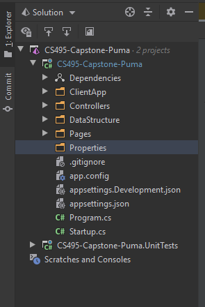
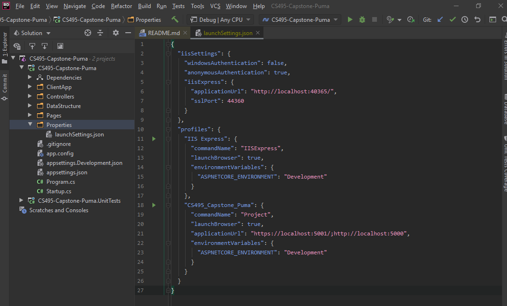
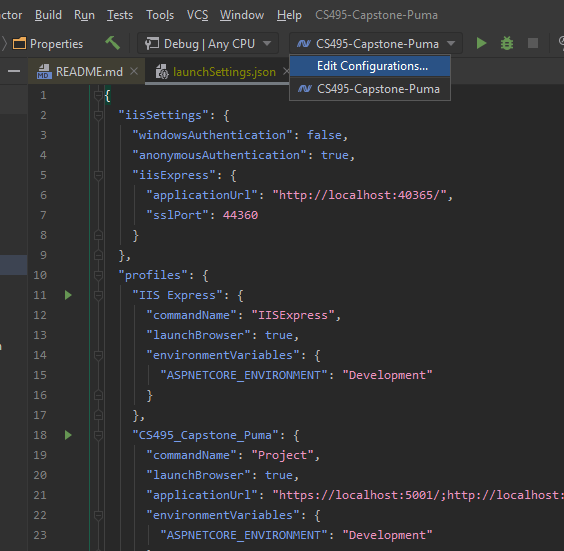
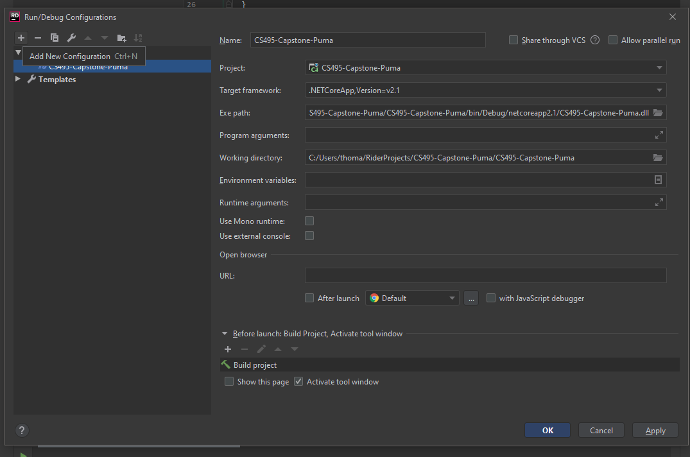
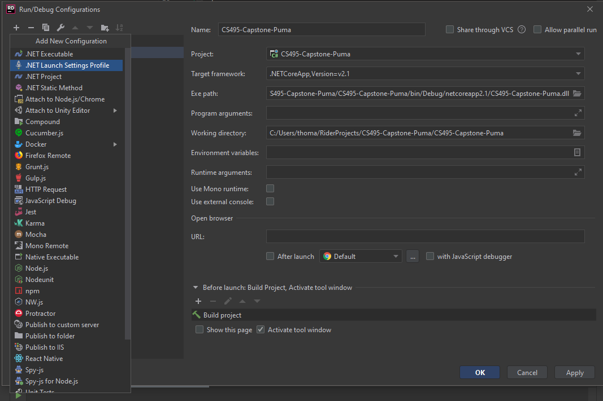
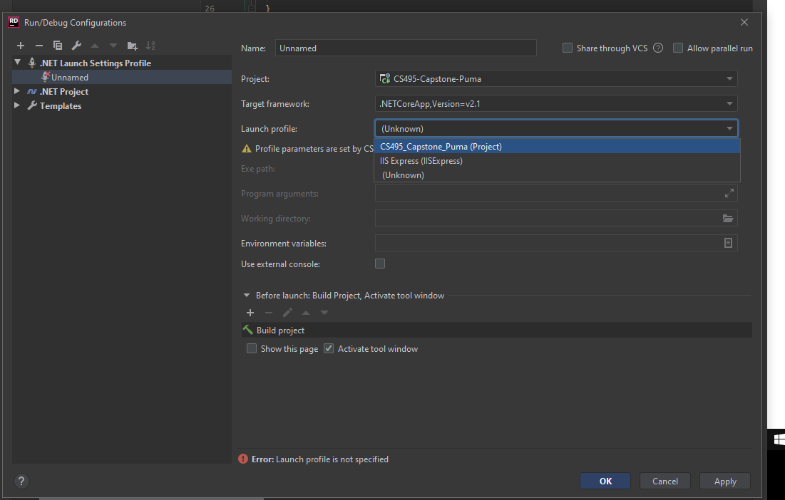

# Development.md
## Tech Stack
Puma is a Web application using: 
* Javascript(es6) and React framework (16.12.0) frontend
* C# asp.net core (2.1 backend
* Local hosting
* MVC architecture (per asp.net core)

## Development Environment
* NPM: https://www.npmjs.com/ **OR** Yarn: https://yarnpkg.com/lang/en/
* Jetbrains Rider 2019.2.2: https://www.jetbrains.com/rider/

## Folder Structure
In the project folder, there are 4 main folders: 
* Client App 
	* Code for view layer of the application
	* Includes miscellanea such as icons and other visual resources
	* Main React App & composite components in separate folder
	* Jest tests are included alongside the associated components
	* Package.json file
		* Lists javascript dependencies required to be installed in order for the project to run correctly
* Controllers
	* Simple Web API PumaController.cs
		* Interfaces between the view and the model
* DataStructure
	* C# objects corresponding to relevant JSON structures
	* Folder Nesting represents Object nesting in JSON
* Model
	* Code for interfacing with Cheetah software
		* HttpRequests
		* Parsing Cheetah JSON Response
		
## Important Notice
* While this will allow anyone to setup the exact development enviornment that is used, it is currently missing the login.json file that we use in order to properly communicate with the Cheetah API. You will not be able to use the project to its fullest from the development envoirnment. This is however added in our deployed version. This will be changed in the next iteration with the addition of a Login page.
		
## Running the project within the development enviornment

1. The first thing you will notice is an installation for our dependancies. Please make sure to run the 'npm install' that will appear in the bottom right of the IDE.

2. Once the dependencies are installed you can begin to explore the folder structure on the left side of the project. Make sure to go into the CS495-Capstone-Puma C# project folder, inside of here you will find our front and backends. The front end is placed in the ClientApp folder and the back end occupies the other folders.

3. In order to run our project properly you will need to setup a launch settings file, start by adding a new directory to the root of the C# project and naming it "Properties". It should look like this.  
* 

4. Next you will need to create a JSON file inside of the folder you just created, the file will be called launchSettings.json. you will need to copy paste the contents of the launchSettings found in our documentation directory into the json file. When finished you should have a directory and a launchSettings.json file that looks like this
* 

5. From here you need to make your way to the launch configuration dropdown menu and select edit configurations
* 

6. Select add new configuration in the top left, it will just be the plus symbol
* 

7. Select .NET Launch Settings Profile, the second option in the drop down menu
* 

8. From here you will select the launch profile drop-down menu and make sure its set to CS495_Capston_Puma (Project)
* 

9. Now select Apply and Ok at the bottom of that page and you should be good to go, if you left the launch profile Unamed you will notice a launch profile named "Unamed" to the left of the play button at the top of the IDE, this means the launch settings should be good to go. You can run the project by hitting the green play button sitting next to the launch profile.

10. At this moment we have had instances of dependecies not making it into our initial npm install. So please make sure to run both of these in the terminal at the bottom of the IDE if you're having launch issues at this point.

* npm install --save react-chartjs-2 chart.js
* npm install --save flexbox-react

11. From here the project should be up and running in the development envoirnment.
