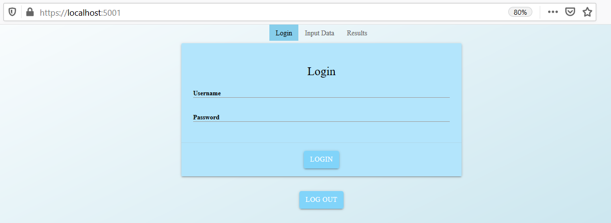
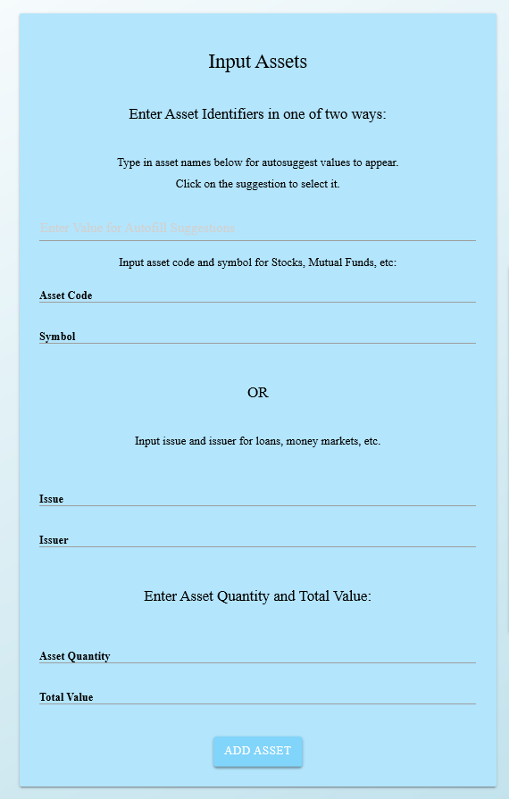
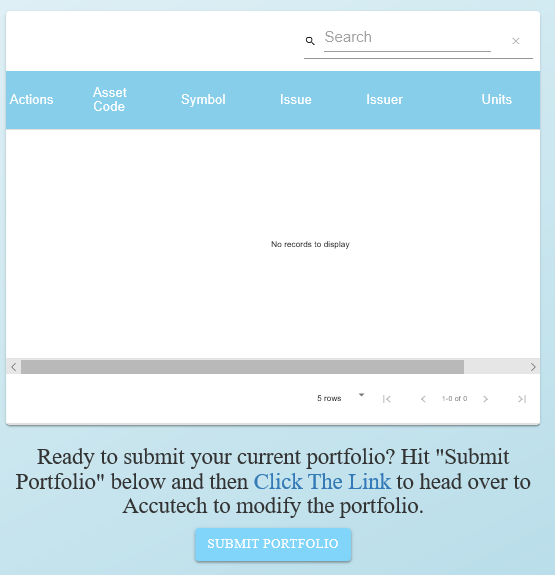
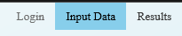

# Using Puma

## Puma Feature
- Minimum amount of tabs for ease of use
- A login screen to ensure security for Accutech Cheetah
- Only one page of fields that are needed to fill out
- Puma sends your inputed data through to Cheetah and gets information sent back
- View your results after Cheetah has finished its calculations and sent them back to Puma

## Getting Started

- Download the PumaVersion4.zip file and unzip it
- Locate CS495-Capstone-Puma.exe and run it
- Once the executable has run, copy the https://localhost:5001 url into your preferred browser
- Upon runnin, you will be greeted with a login screen. Use your Cheetah login to continue
* 
  - If you do not have a Cheetah login, contact any of the Puma team (*see below*) for a live demo
  

## Using Puma

- Once logged in, you should first make your way to the "Input Data" tab
- Fill out your data using the input fields on the left of the screen
* 
- Once finished building your porfolio, use the link in the bottom right of the page as well as the "Submit Portfolio" button
* 
- After Cheetah has been sent your data, it is time to move to the "Results" tab to see your results
* 
- You can now use the side-by-side comparison to see how much using Accutech will change your profits

## Contact
- japerales@bsu.edu
- rdbabusiak@bsu.edu
- tmferrigan@bsu.edu
- jcknoll@bsu.edu
